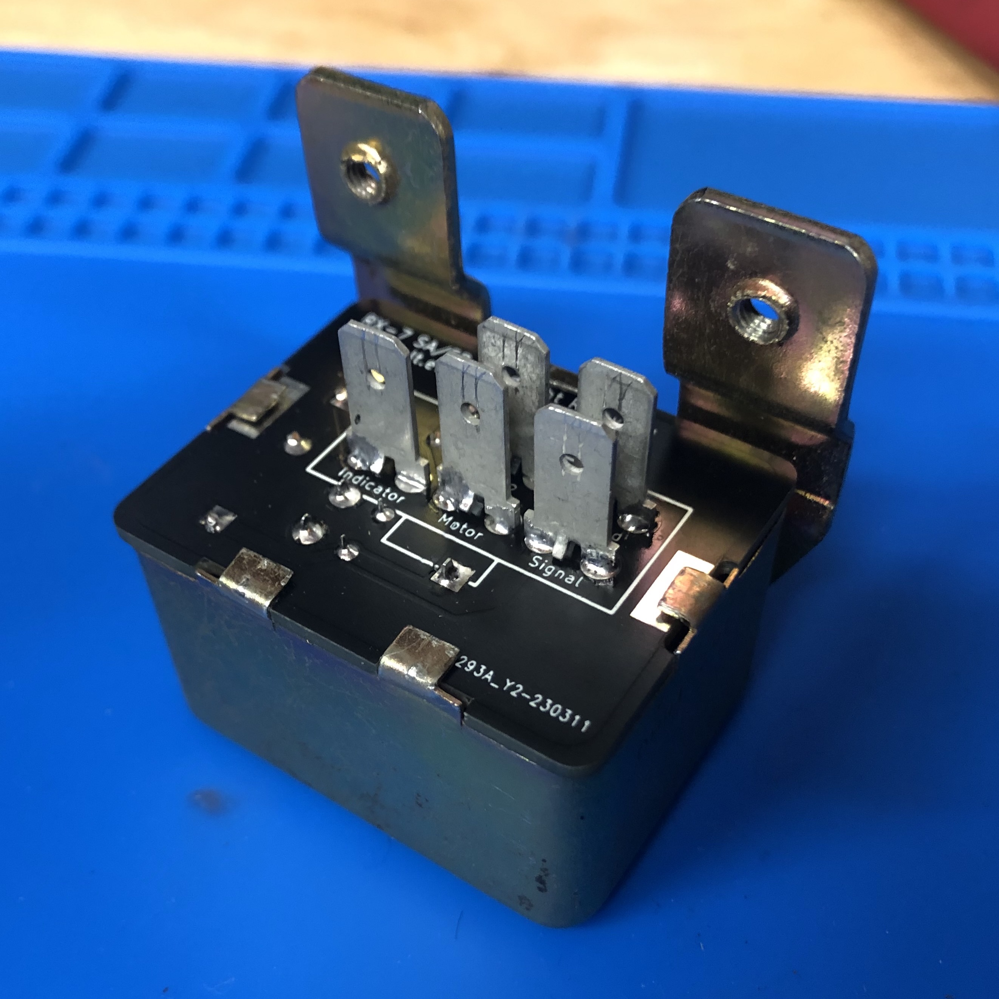

# RX-7 SA Headlight Relay Board

A replacement headlight assembly relay board for the 1979-1980 Mazda RX-7.

## Context

The first generation Mazda RX-7 SA (79-80) features a self-contained pop-up headlight assembly. This assembly contains the sensor and relay necessary to correctly position itself in the up or down position dependent on signal.

After decades of operation the relay in this assembly may fail, causing the headlight to no longer go up and down, or do so intermittently. While this relay could be replaced with a generic automotive relay, some functionality could be lost as it includes an additional diode protected output for the dashboard headlight indicator.

This project defines a replacement board with modern easily sourcable parts that maintains original functionality with no modifications necessary to wiring and no visible changes.

## Prerequisit Reading

Please understand the RX-7 wiring diagram before attempting any electrical work!

Original Source: http://www.wright-here.net/files/manuals/1979RX7WiringDiagram.pdf

Archive for posterity: https://archive.org/details/1979-rx-7-wiring-diagram

## Sections

- [Teardown](./documentation/00-teardown.md)
- [Design](./documentation/01-design.md)
- [Parts](./documentation/02-parts.md)
- [Construction](./documentation/03-construction.md)

## Directory Structure

- `documentation` - documentation for the project
- `hardware` - KiCad hardware design files
- `production` - production files for the PCB (zip this up and send it to your favorite PCB manufacturer)

## Caveats

- I suspect this will work with the FB RX-7 but cannot verify since the headlight assembly appears to be slightly different
- This was my first PCB project
- Please understand what you are doing; I bear no responsibility for any damage you may cause to yourself or your vehicle
- Manufacturing of the board is not included in the scope of this project; there are plenty of low cost pcb manufacturers that can guide you through the process
