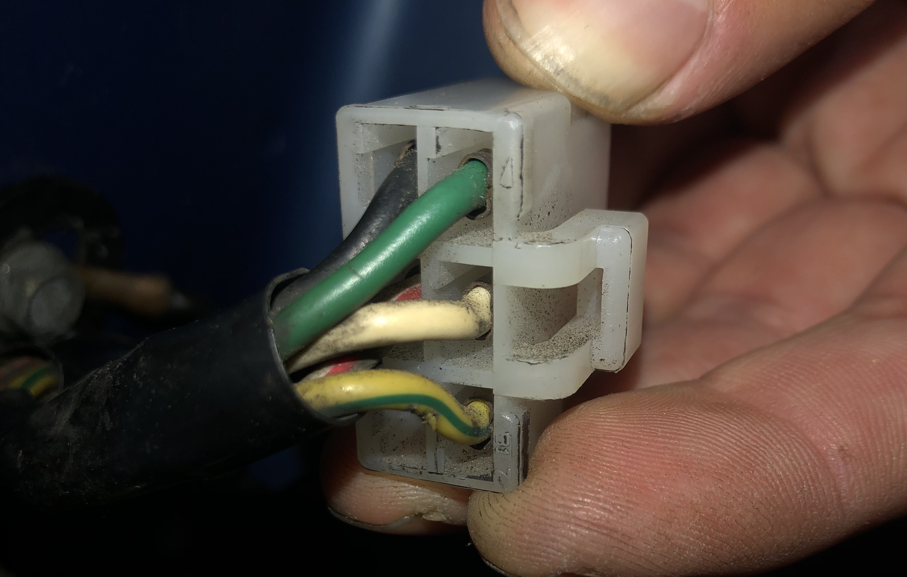

# Teardown

## Headlight Assembly

The headlight assembly in the early RX-7 consists of a geared DC motor with integrated sensor and attached relay. When replacing the relay, one does not need to remove the assembly entirely (unless you want to clean it and relubricate it, which isn't a bad idea after 40 years).

The relay, which is enclosed in the black rubber sleeve, is attached to the motor assembly via a circular metal bracket and a 6 pin connector. Gently push back the sleeve to reveal the connector (note the sleeve will likely rip if it hasn't already).

Once unplugged and the bracket loosened, it may be removed from the assembly, two philips screws can be removed to separate the bracket from the relay and sleeve. The sleeve may then be removed and you will be left with the original relay.

After bending the enclosure tabs, one can remove the board with the terminals and relay. With the metal enclosure removed, one can see the relay contacts. An attempted cleaning using emery paper resulted in slightly better performance, but did not make the headlight reliable.

This circuit board was used as the basis for the design of the replacement board detailed in [the next section](./01-design.md).

## Errata

The sensor portion of the motor is located under the circular rubber cab with three wires going in. In the schematic, this is represented as the switch within a circle with the two diodes leading into it. In hardware, this consists of three circular tracks and the switch contacts which rotate with the motor output shaft. Depending on the position of the shaft, the contacts will be made or broken, providing or removing power from the motor respectively.

Continue to [design](./01-design.md)
