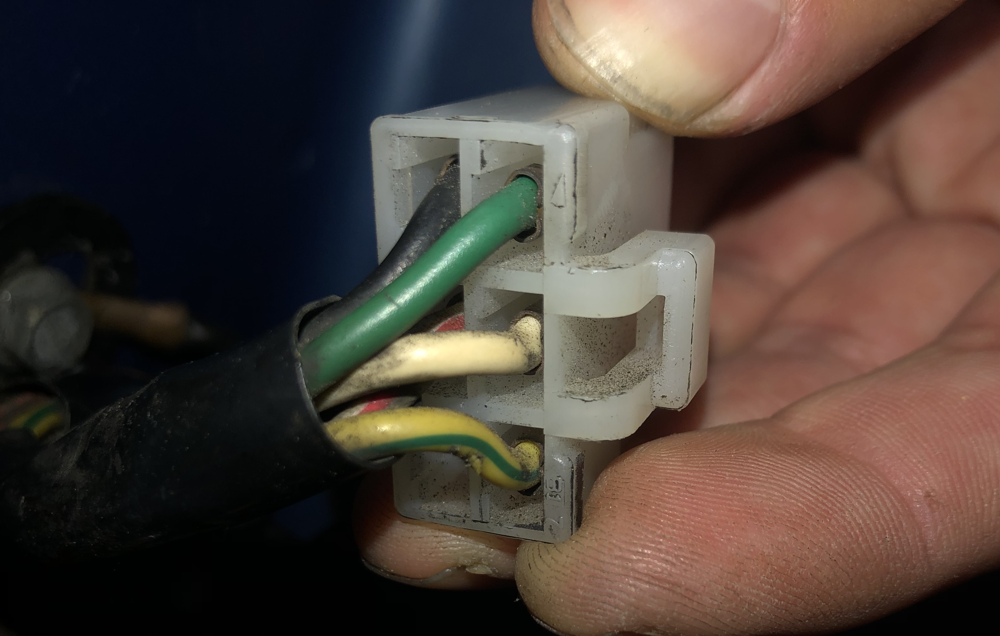
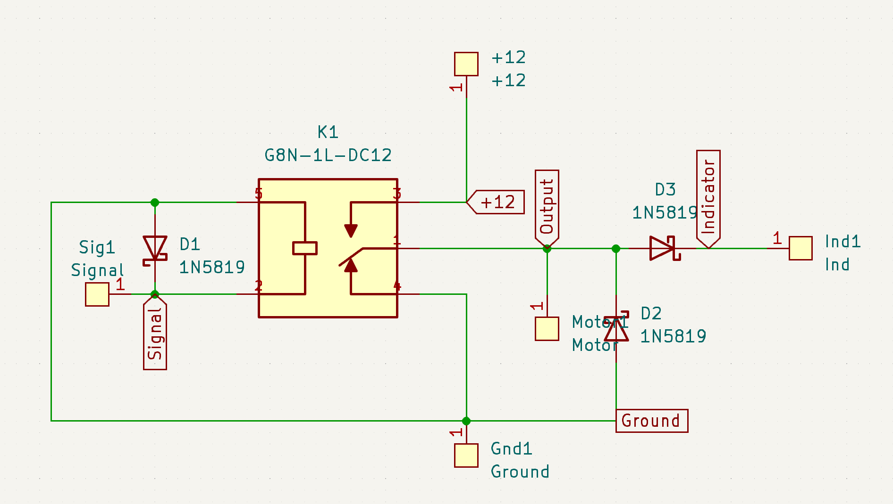
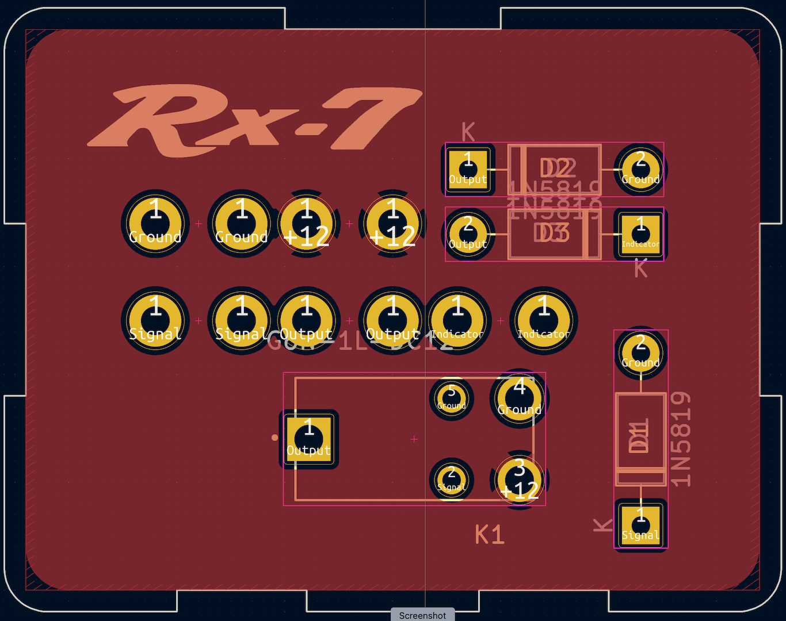
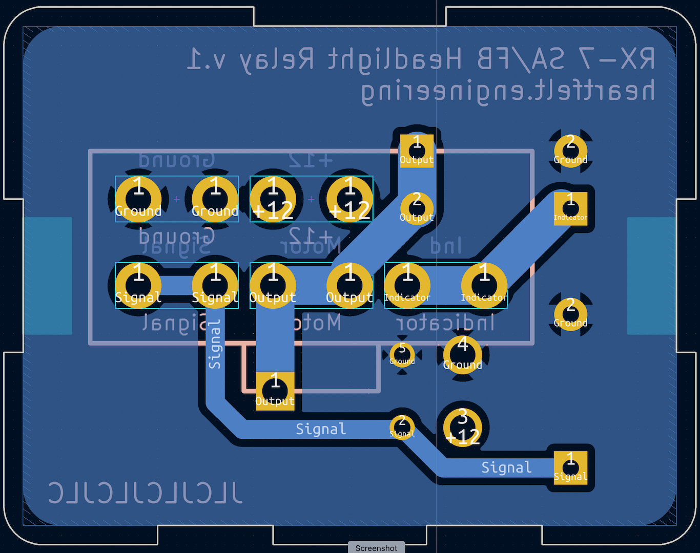

# Design

The circuit board was designed to fit into the housing of the original relay and provide the same connections.

## Connections

The first order of business was to trace the wiring of the connector. Because it is part of the headlight assembly, it was not detailed in the RX-7 wiring diagram.

Using the color codes indicated defined in the wiring diagram, the connections were traced as follows:

```
Pin numbers when looking at the connector from the side of the wires
__|-|__
|1 2 3|
|4 5 6|
-------
```

| Pin | Color                     | Function  | Description                                                  |
| --- | ------------------------- | --------- | ------------------------------------------------------------ |
| 1   | G (Green)                 | Signal    | The signal from the sensor; High = motor on, Low = motor off |
| 2   | W (White)                 | Motor     | The output to provide 12 volts to the motor                  |
| 3   | YG (Yellow, green stripe) | Indicator | The diode protected output to the dashboard indicator        |
| 4   | B (Black)                 | Ground    | The ground connection for the motor                          |
| 5   | WR (White, red stripe)    | 12V       | The constant 12 volt power connection                        |
| 6   |                           |           | No connection                                                |



## Schematic

With the connection traced, the schematic was designed.



The configuration of the schematic matches that of the original; the relay `K1` switches the motor between ground and 12 volts. The output of the relay, pin 1, feeds the motor directly. The dashboard indicator light is fed through diode `D3` in order to prevent current from flowing back through the motor from the other headlight.

Diodes `D1` and `D2` are flyback diodes to prevent voltage spikes from the inductive loads of the relay and motor coil; though not included in the original design and technically optional, these will help extend the lives of both the driver's light switch and relay contacts and add minimal cost.

## Layout

The physical layout of the PCB and components was primarily dictated by the dimensions of the original relay enclosure, connector, and desire to keep high current traces short and fat. A two layer circuit board was used for ease of routing.



The top layer of the PCB, which is intended to be protected inside the original relay's metal housing, contains the components and a power plane. The power plane ensures the least resistance for the high current connections between 12V and the motor output.



The bottom layer includes the connector and associated routing, all surrounded by a ground plane. Once again a ground plane was used to provide as low resistance as possible. Traces were also made as wide as possible given the space constraints caused by the connector. The silkscreen of the connector with the locking tab was included to indicate proper orientation of the 6 pin connector.

Continue to [parts](./02-parts.md).
