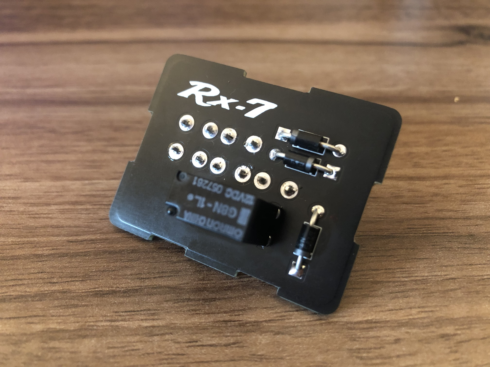
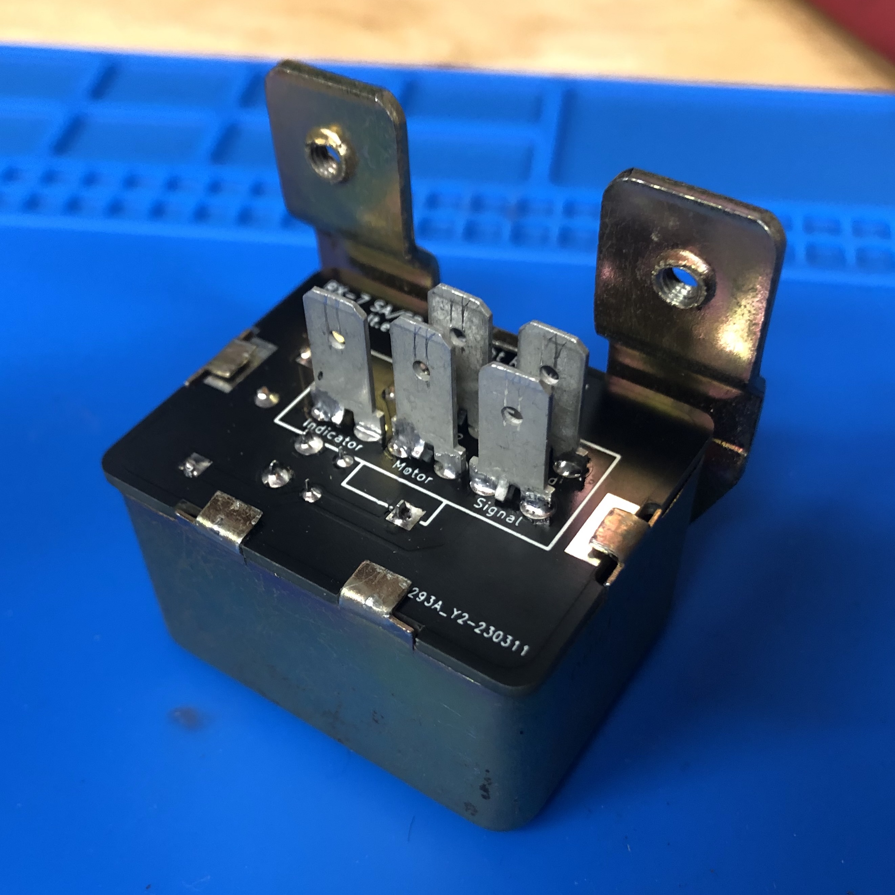

# Construction

With PCB and parts in hand, we can now begin populating the board.

## Bottom Layer

### Terminal Connections

I suggest first soldering the terminal tab connections, as these require a good amount of heat.

With the board mounted in a vice bottom side up, I tacked each terminal in place with a small amount of solder to one of the two pins. Once they were all tacked in place, I flipped the board over so that the top component side faced upward and soldered them fully. Remember to solder the unsoldered terminal first or the terminal may fall out of the board.

This was tedious; a future improvement would be to 3d print a fixture to hold all 5 terminal tabs in alignment so they can be soldered in one go.

## Top Layer

### Diodes

Next on the top layer of the board, the diodes were then soldered in place, and their leads cut flush. Make sure to match the polarity of the diodes to that printed on the PCB silkscreen.

### Relay

Finally the relay should be soldered in place; be sure all 5 connections are made.

## Testing

Before inserting the board into the relay housing, it is a good idea to test the board to make sure it works. Connect it to the original headlight wiring harness and switch on the headlights; The headlights should rise and lower as expected.

## Housing

Now the completed board may be inserted into the original relay housing. Fold the tabs back over to retain the board in place, and the rest of reassembly is the reverse of tear down.

